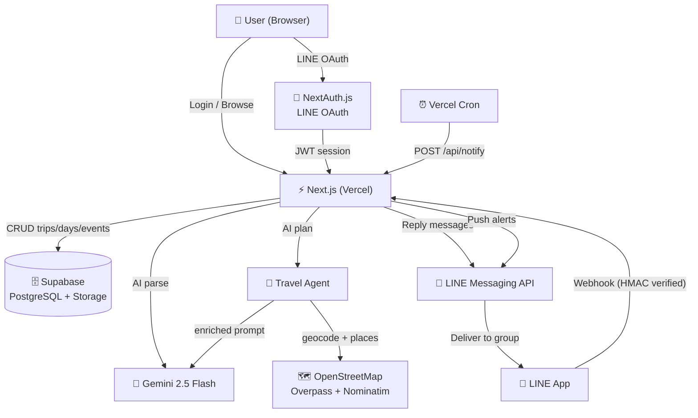

# Tabitomo — タビトモ

**AI-powered group travel planner with LINE bot integration.**

Plan trips together, share itineraries via LINE, and let AI organize your schedule — all in one place.

---

## Demo

> Deploy your own → [Deploy to Vercel](#deployment)

---

## Features

- **AI Itinerary Suggestion (Web)** — Fill a guided form (destination, days, start date, members, budget, travel style, free notes); the Travel Agent fetches real places and Gemini 2.5 Flash generates a full day-by-day itinerary shown as a preview before saving
- **Travel Agent (Real Place Enrichment)** — Before planning, the agent geocodes the destination (Nominatim) and pulls real tourism spots and restaurants from OpenStreetMap (Overpass API), ranks them by rating / distance / budget / personal preference, and feeds the top candidates into the planner so itineraries use actual named venues. Degrades gracefully to a plain plan if any provider is unavailable
- **Recommended Spots Panel** — Trip detail page shows an おすすめスポット panel with an interactive OpenStreetMap (Leaflet) plotting spots + restaurants, plus cards with distance badges; one tap adds any spot to a chosen trip day
- **AI Itinerary Import** — Paste raw travel text; Gemini parses it into a structured plan shown as a preview before saving
- **LINE Bot AI Suggestion** — Trigger step-by-step guided trip planning directly in a LINE chat; uses datetimepicker Flex Message for start date and Flex Message buttons (保存する / やり直す / キャンセル) for final confirmation before saving to DB
- **LINE OAuth Login** — One-tap sign-in with your LINE account, no password required
- **LINE Bot (Tabitomo Bot)** — Query today's schedule, upcoming events, specific dates, or weather directly from a LINE group chat; edit events, add/delete, and update trip-level info (人数・予算・交通手段) via natural language
- **Weather Forecast** — Real-time 16-day weather per trip day via Open-Meteo; Nominatim (OpenStreetMap) fallback for locations not in GeoNames (e.g. small islands)
- **Team Collaboration** — Invite up to 20 members via a shareable link; manage member roles and remove members
- **Ticket & File Attachments** — Upload PDF/image tickets per event; badge shown on event cards; LINE bot sends them inline
- **Push Notifications** — Event alerts delivered to LINE groups at configurable lead times (optimized cron with DB indexes)
- **Trip Duplication** — Duplicate any trip with one-click confirmation
- **Trip Info Editing** — Edit member count, budget, and transport mode directly from the web UI
- **Drag-and-Drop Reorder** — Reorder trip days with drag handles
- **Export** — Copy full itinerary as plain text or LINE-formatted message
- **Audit Log & Restore** — Every INSERT/UPDATE/DELETE is logged via PostgreSQL triggers; deleted events, days, members, and trips can be restored via API
- **Animated Background** — Canvas-based aurora, particles, shooting stars, and airplane trails
- **Responsive** — Mobile-first layout with auto-degraded animation on small screens
- **Reduced Motion** — Respects `prefers-reduced-motion` system preference

---

## Tech Stack

### Frontend
| | |
|---|---|
| Framework | [Next.js 16.2.9](https://nextjs.org) (App Router) |
| Language | TypeScript 5 (strict mode) |
| Styling | Tailwind CSS v4 |
| Runtime | React 19 |
| Maps | Leaflet + OpenStreetMap tiles (recommended-spots map) |

### Backend
| | |
|---|---|
| API | Next.js API Routes |
| Webhook | LINE Messaging API (HMAC-SHA256 verified) |
| Cron | Vercel Cron via `/api/notify` |

### Database & Storage
| | |
|---|---|
| Database | [Supabase](https://supabase.com) (PostgreSQL) |
| Storage | Supabase Storage (ticket files) |
| Client | `@supabase/supabase-js` v2 |

### Authentication
| | |
|---|---|
| Provider | [NextAuth.js v4](https://next-auth.js.org) |
| Strategy | JWT (stateless) |
| OAuth | LINE Login (OIDC) |

### AI
| | |
|---|---|
| Parser / Planner | Google Gemini 2.5 Flash (`@google/generative-ai`); auto-retry on 503 + fallback to Gemini 2.0 Flash |
| Travel Agent | `lib/agents/travel/` — geocode (Nominatim) → place providers (Overpass / OpenStreetMap) → ranking engine → enriched Gemini planner; never throws, degrades to plain plan |
| Place Data | OpenStreetMap via Overpass API (tourism spots + restaurants); free, no API key |
| LINE Bot NLU | Regex intent parser → Gemini fallback |
| Suggest Session | Step-by-step state machine stored in `suggest_sessions` (15-min TTL) |
| Pending Actions | Confirmation flow with 10-min expiry |

### Deployment
| | |
|---|---|
| Hosting | [Vercel](https://vercel.com) |
| CI/CD | GitHub → Vercel (automatic) |

---

## Architecture



---

## Database Schema

```
trips              — Trip metadata (title, budget, transport, destination)
trip_days          — Days within a trip (ordered by position)
events             — Events per day (time, type, note, alert_min)
tickets            — File attachments per event
trip_members       — User ↔ Trip association (owner / member, max 20)
invite_tokens      — Shareable invite links (7-day expiry, multi-use)
pending_actions    — LINE bot confirmations (10-min expiry)
suggest_sessions   — LINE bot AI suggest session state (15-min TTL)
travel_preferences — Saved user travel preferences (destination, tags, budget) for personalization
place_cache        — Cached Overpass/OSM place candidates per destination (7-day TTL)
user_profiles      — Cached LINE display name & avatar
audit_logs         — Full change history (INSERT/UPDATE/DELETE) for all tables
```

---

## API Routes

| Method | Route | Description |
|--------|-------|-------------|
| GET/POST | `/api/trips` | List / create trips |
| PATCH | `/api/trips/[id]` | Update members / budget / transport (member) |
| DELETE | `/api/trips/[id]` | Delete trip (owner only) |
| POST | `/api/trips/import` | AI-powered itinerary import |
| GET/DELETE | `/api/trips/[id]/members` | List / remove members |
| POST/DELETE | `/api/trips/[id]/invite` | Generate / revoke invite link |
| GET/POST | `/api/trips/[id]/alert` | Notification settings |
| GET/POST | `/api/days` | List / create days |
| PATCH/DELETE | `/api/days/[id]` | Update / delete day |
| POST | `/api/days/reorder` | Reorder days |
| POST | `/api/events` | Create event |
| PATCH/DELETE | `/api/events/[id]` | Update / delete event |
| POST | `/api/tickets` | Upload ticket file |
| GET | `/api/tickets/[id]/url` | Get signed download URL |
| POST | `/api/line/webhook` | LINE bot webhook (message + postback events) |
| POST | `/api/parse` | AI text → itinerary JSON |
| POST | `/api/suggest` | AI suggestion form → Travel Agent → itinerary + spots/restaurants JSON |
| GET | `/api/travel/recommend` | Travel Agent recommendations (spots + restaurants) for a destination |
| GET/POST | `/api/notify` | Cron-triggered push alerts |
| GET | `/api/admin/audit` | Audit log list for a trip (owner only) |
| POST | `/api/admin/audit/[id]/restore` | Restore a deleted / updated record |

---

## LINE Bot Commands

Once a LINE group is linked to a trip:

**AI suggestion (no group link required):**

| Input | Action |
|-------|--------|
| `@Tabi 沖縄3日提案して` | Start step-by-step AI itinerary suggestion |
| `@Tabi 京都2泊3日おすすめ行程` | Pre-fills destination + days, asks remaining steps |

The bot guides through: destination → days → start date (datetimepicker) → members → budget → notes → preview (Flex Message confirm)

**Read commands (all members):**

| Input | Response |
|-------|----------|
| `help` / `ヘルプ` | Command guide |
| `今日` / `今天` | Today's schedule + ticket files |
| `明日` / `明天` | Tomorrow's schedule |
| `行程` / `全体` | Full itinerary overview |
| `7/18` / `Day2` / `第2天` | Schedule for a specific date |
| `次の予定` / `下一個` | Next upcoming event today |
| `今日の残り` / `今天剩下` | Remaining events today |
| `成員` / `メンバー` | Member list with roles |
| `概要` | Trip summary (dates, budget, transport) |
| `最終日` | Last day's schedule |
| `住宿` / `宿泊` | All stay events |
| `交通` / `フライト` | All transport events |
| `残り何日` / `還有幾天` | Days remaining until trip ends |
| `何日目` / `今天第幾天` | Current day number of the trip |
| `[event]幾點` / `[event]はいつ` | Time lookup by event name |
| `天気` / `天氣` / `weather` | 16-day weather forecast for the trip destination |

**Edit commands (owner/editor only — requires confirmation):**

| Input | Action |
|-------|--------|
| `咖啡廳改18:30` / `夕食改下午六點` | Update event time |
| `集合延後30分` | Delay event by N minutes |
| `集合提前30分` | Advance event by N minutes |
| `把晚餐改到19:00` / `把X移到Y` | Retime event |
| `取消晚餐` / `把晚餐刪掉` | Delete event |
| `新增下午兩點 海灘散步` | Create event |
| `明天下午三點加咖啡廳` | Create event on a specific day |
| `人數改5人` / `参加人数5` | Update trip member count |
| `預算改5萬` / `予算を3万円に` | Update trip budget |
| `交通手段改飛機` / `交通改バス` | Update trip transport mode |

---

## Getting Started

### Prerequisites

- Node.js 18+
- [Supabase](https://supabase.com) project
- [LINE Developers](https://developers.line.biz) account (Login + Messaging API channels)
- [Google AI Studio](https://aistudio.google.com) API key (Gemini)
- [Vercel](https://vercel.com) account

### Local Development

```bash
git clone https://github.com/z02398741/tabitomo.git
cd tabitomo
npm install
cp .env.example .env.local
# Fill in .env.local with your keys
npm run dev
```

Open [http://localhost:3000](http://localhost:3000).

### Environment Variables

| Variable | Description |
|----------|-------------|
| `NEXT_PUBLIC_SUPABASE_URL` | Supabase project URL |
| `NEXT_PUBLIC_SUPABASE_ANON_KEY` | Supabase anon key |
| `SUPABASE_SERVICE_ROLE_KEY` | Supabase service role key (server-only) |
| `LINE_LOGIN_CHANNEL_ID` | LINE Login channel ID |
| `LINE_LOGIN_CHANNEL_SECRET` | LINE Login channel secret |
| `LINE_MESSAGING_CHANNEL_SECRET` | LINE Messaging API channel secret |
| `LINE_MESSAGING_ACCESS_TOKEN` | LINE Messaging API access token |
| `NEXTAUTH_URL` | Your app URL |
| `NEXTAUTH_SECRET` | Random secret for NextAuth |
| `NEXT_PUBLIC_APP_URL` | Public app URL (used in invite links) |
| `GEMINI_API_KEY` | Google Gemini API key |
| `CRON_SECRET` | Secret to authenticate cron requests |

---

## Deployment

### Deploy to Vercel

[](https://vercel.com/new/clone?repository-url=https://github.com/z02398741/tabitomo)

1. Click the button above
2. Add all environment variables from `.env.example`
3. Set `NEXTAUTH_URL` and `NEXT_PUBLIC_APP_URL` to your Vercel deployment URL
4. Set LINE webhook URL to: `https://your-app.vercel.app/api/line/webhook`

### Database Setup

Run the following SQL in your Supabase SQL editor:

```sql
create table trips (
  id uuid primary key default gen_random_uuid(),
  title text not null,
  members integer,
  budget text,
  transport text,
  destination text,
  line_group_id text,
  created_by text not null,
  created_at timestamptz not null default now()
);

create table trip_days (
  id uuid primary key default gen_random_uuid(),
  trip_id uuid not null references trips(id) on delete cascade,
  date date,
  label text not null,
  position integer not null default 0
);

create table events (
  id uuid primary key default gen_random_uuid(),
  day_id uuid not null references trip_days(id) on delete cascade,
  time text not null,
  title text not null,
  type text not null,
  note text,
  alert_min integer not null default 0,
  notified_at timestamptz
);

create table tickets (
  id uuid primary key default gen_random_uuid(),
  event_id uuid not null references events(id) on delete cascade,
  name text not null,
  storage_path text
);

create table trip_members (
  trip_id uuid not null references trips(id) on delete cascade,
  user_id text not null,
  role text not null default 'member',
  primary key (trip_id, user_id)
);

create table invite_tokens (
  id uuid primary key default gen_random_uuid(),
  token text not null unique,
  trip_id uuid not null references trips(id) on delete cascade,
  used boolean not null default false,
  expires_at timestamptz not null,
  created_at timestamptz not null default now()
);

create table pending_actions (
  id uuid primary key default gen_random_uuid(),
  group_id text not null,
  user_id text not null,
  trip_id uuid not null references trips(id) on delete cascade,
  action_json jsonb not null,
  expires_at timestamptz not null,
  created_at timestamptz not null default now()
);

create table suggest_sessions (
  group_id   text        not null,
  user_id    text        not null,
  session_json jsonb     not null,
  expires_at timestamptz not null,
  created_at timestamptz not null default now(),
  primary key (group_id, user_id)
);

create table travel_preferences (
  id          uuid        primary key default gen_random_uuid(),
  user_id     text        not null,
  destination text        not null,
  tags        text[]      not null default '{}',
  budget      text        not null default 'moderate',
  created_at  timestamptz not null default now()
);
create index on travel_preferences (user_id);

create table place_cache (
  destination text        primary key,
  data        jsonb       not null,
  expires_at  timestamptz not null,
  created_at  timestamptz not null default now()
);

create table user_profiles (
  id text primary key,
  name text,
  image text,
  updated_at timestamptz not null default now()
);

-- Audit log (auto-populated by triggers)
create table audit_logs (
  id          bigserial    primary key,
  table_name  text         not null,
  operation   text         not null,
  row_id      text,
  trip_id     uuid,
  old_data    jsonb,
  new_data    jsonb,
  created_at  timestamptz  not null default now()
);
create index on audit_logs(trip_id);
create index on audit_logs(created_at desc);

create or replace function log_changes()
returns trigger language plpgsql security definer as $$
declare
  _row_id text; _trip_id uuid; _data jsonb;
begin
  _data := case when tg_op = 'DELETE' then row_to_json(OLD)::jsonb else row_to_json(NEW)::jsonb end;
  case tg_table_name
    when 'trip_members'  then _row_id := null;
    when 'invite_tokens' then _row_id := _data->>'token';
    else                      _row_id := _data->>'id';
  end case;
  case tg_table_name
    when 'trips'         then _trip_id := (_data->>'id')::uuid;
    when 'trip_days'     then _trip_id := (_data->>'trip_id')::uuid;
    when 'events'        then select trip_id into _trip_id from trip_days where id = (_data->>'day_id')::uuid;
    when 'trip_members'  then _trip_id := (_data->>'trip_id')::uuid;
    when 'invite_tokens' then _trip_id := (_data->>'trip_id')::uuid;
    else _trip_id := null;
  end case;
  if tg_op = 'DELETE' then
    insert into audit_logs(table_name,operation,row_id,trip_id,old_data)
    values(tg_table_name,tg_op,_row_id,_trip_id,row_to_json(OLD)::jsonb); return OLD;
  elsif tg_op = 'UPDATE' then
    insert into audit_logs(table_name,operation,row_id,trip_id,old_data,new_data)
    values(tg_table_name,tg_op,_row_id,_trip_id,row_to_json(OLD)::jsonb,row_to_json(NEW)::jsonb); return NEW;
  else
    insert into audit_logs(table_name,operation,row_id,trip_id,new_data)
    values(tg_table_name,tg_op,_row_id,_trip_id,row_to_json(NEW)::jsonb); return NEW;
  end if;
end;
$$;

create trigger trips_audit         after insert or update or delete on trips         for each row execute function log_changes();
create trigger trip_days_audit     after insert or update or delete on trip_days     for each row execute function log_changes();
create trigger events_audit        after insert or update or delete on events        for each row execute function log_changes();
create trigger trip_members_audit  after insert or update or delete on trip_members  for each row execute function log_changes();
create trigger invite_tokens_audit after insert or update or delete on invite_tokens for each row execute function log_changes();
```

---

## Project Structure

```
tabitomo/
├── app/
│   ├── api/
│   │   ├── auth/[...nextauth]/   # NextAuth — LINE OAuth
│   │   ├── trips/                # Trip CRUD + import + invite + members
│   │   ├── days/                 # Day CRUD + reorder
│   │   ├── events/               # Event CRUD
│   │   ├── tickets/              # File upload + signed URL
│   │   ├── admin/audit/          # Audit log list + restore endpoint
│   │   ├── line/webhook/         # LINE bot webhook (message + postback events)
│   │   ├── notify/               # Cron push notifications
│   │   ├── parse/                # AI itinerary parser
│   │   ├── suggest/              # AI itinerary suggestion (via Travel Agent)
│   │   └── travel/recommend/     # Travel Agent recommendations (spots + restaurants)
│   ├── components/
│   │   └── TechBackground.tsx    # Canvas animation (aurora, particles, meteor, parallax)
│   ├── trips/[id]/               # Trip detail page
│   ├── import/                   # AI import page
│   ├── suggest/                  # AI suggestion page
│   ├── invite/[token]/           # Invite accept page
│   ├── login/                    # Login page
│   └── page.tsx                  # Home (trip list)
├── components/
│   ├── HomeClient.tsx            # Trip list UI (with duplicate + AI suggestion CTA)
│   ├── TripClient.tsx            # Trip detail UI (events, days, modals)
│   ├── ImportClient.tsx          # AI import UI (parse → preview → save)
│   ├── SuggestClient.tsx         # AI suggestion UI (form → preview → save)
│   ├── LoginButton.tsx           # LINE login button
│   └── logo/TabitomoLogo.tsx     # Animated SVG bird mascot
├── lib/
│   ├── ai/gemini.ts              # Gemini 2.5 Flash client (LINE bot NLU)
│   ├── agents/travel/            # Travel Agent
│   │   ├── agent.ts              # runTravelAgent() orchestrator (geocode → fetch → rank → plan)
│   │   ├── geo.ts                # Haversine distance helper
│   │   ├── ranking.ts            # Candidate scoring (rating / distance / budget / preference)
│   │   ├── planner.ts            # Enriched Gemini planner (retry + fallback)
│   │   ├── providers/            # Place providers (Overpass spots / restaurants; hotel + transport stubs)
│   │   ├── memory/preferences.ts # travel_preferences load / save
│   │   └── prompts/suggest.ts    # System prompt + candidate block builder
│   ├── line/
│   │   ├── reply.ts              # LINE reply / push message helpers
│   │   └── suggest.ts            # LINE bot AI suggest session state machine
│   ├── rules/                    # LINE bot intent parser (regex + AI fallback)
│   ├── actions/pending.ts        # Pending confirmation store
│   ├── supabase/                 # Supabase clients (browser / server / admin)
│   ├── weather.ts                # Open-Meteo weather + Nominatim geocode fallback
│   └── trips.ts                  # Trip data access layer
└── types/
    ├── index.ts                  # Trip, Event, TripDay, Ticket, TripMember
    ├── action.ts                 # ParsedAction, PendingActionRecord
    └── line.ts                   # LINE webhook event types
```

---

## License

MIT
