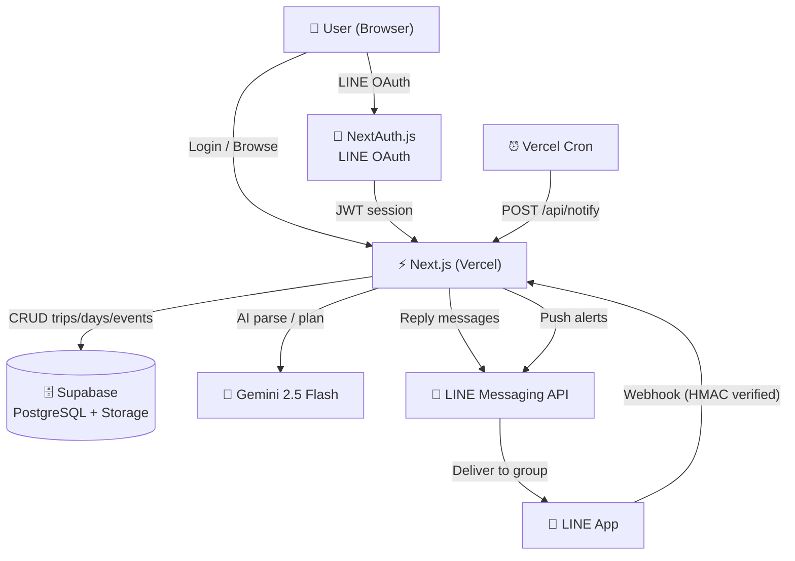

# Tabitomo — タビトモ

**AI-powered group travel planner with LINE bot integration.**

Plan trips together, share itineraries via LINE, and let AI organize your schedule — all in one place.

---

## Demo

> Deploy your own → [Deploy to Vercel](#deployment)

---

## Features

- **AI Itinerary Generation** — Paste raw text or describe a trip; Gemini 2.5 Flash generates a structured day-by-day plan
- **LINE OAuth Login** — One-tap sign-in with your LINE account, no password required
- **LINE Bot (Tabitomo Bot)** — Query today's schedule, upcoming events, or specific dates directly from a LINE group chat
- **Team Collaboration** — Invite up to 20 members via a shareable link; manage member roles and remove members
- **Ticket & File Attachments** — Upload PDF/image tickets per event; LINE bot sends them inline
- **Push Notifications** — Event alerts delivered to LINE groups at configurable lead times
- **Drag-and-Drop Reorder** — Reorder trip days with drag handles
- **Export** — Copy full itinerary as plain text or LINE-formatted message
- **Animated Background** — Canvas-based aurora, particles, shooting stars, and airplane trails
- **Responsive** — Mobile-first layout with auto-degraded animation on small screens
- **Reduced Motion** — Respects `prefers-reduced-motion` system preference

---

## Tech Stack

### Frontend
| | |
|---|---|
| Framework | [Next.js 16.2.9](https://nextjs.org) (App Router) |
| Language | TypeScript 5 (strict mode) |
| Styling | Tailwind CSS v4 |
| Runtime | React 19 |

### Backend
| | |
|---|---|
| API | Next.js API Routes |
| Webhook | LINE Messaging API (HMAC-SHA256 verified) |
| Cron | Vercel Cron via `/api/notify` |

### Database & Storage
| | |
|---|---|
| Database | [Supabase](https://supabase.com) (PostgreSQL) |
| Storage | Supabase Storage (ticket files) |
| Client | `@supabase/supabase-js` v2 |

### Authentication
| | |
|---|---|
| Provider | [NextAuth.js v4](https://next-auth.js.org) |
| Strategy | JWT (stateless) |
| OAuth | LINE Login (OIDC) |

### AI
| | |
|---|---|
| Parser / Planner | Google Gemini 2.5 Flash (`@google/generative-ai`) |
| LINE Bot NLU | Regex intent parser → Gemini fallback |
| Pending Actions | Confirmation flow with 10-min expiry |

### Deployment
| | |
|---|---|
| Hosting | [Vercel](https://vercel.com) |
| CI/CD | GitHub → Vercel (automatic) |

---

## Architecture



---

## Database Schema

```
trips              — Trip metadata (title, budget, transport)
trip_days          — Days within a trip (ordered by position)
trip_events        — Events per day (time, type, note, alert_min)
tickets            — File attachments per event
trip_members       — User ↔ Trip association (owner / member, max 20)
invite_tokens      — Shareable invite links (7-day expiry, multi-use)
pending_actions    — LINE bot pending confirmations (10-min expiry)
user_profiles      — Cached LINE display name & avatar
```

---

## API Routes

| Method | Route | Description |
|--------|-------|-------------|
| GET/POST | `/api/trips` | List / create trips |
| DELETE | `/api/trips/[id]` | Delete trip (owner only) |
| POST | `/api/trips/import` | AI-powered itinerary import |
| GET/DELETE | `/api/trips/[id]/members` | List / remove members |
| POST/DELETE | `/api/trips/[id]/invite` | Generate / revoke invite link |
| GET/POST | `/api/trips/[id]/alert` | Notification settings |
| GET/POST | `/api/days` | List / create days |
| PATCH/DELETE | `/api/days/[id]` | Update / delete day |
| POST | `/api/days/reorder` | Reorder days |
| POST | `/api/events` | Create event |
| PATCH/DELETE | `/api/events/[id]` | Update / delete event |
| POST | `/api/tickets` | Upload ticket file |
| GET | `/api/tickets/[id]/url` | Get signed download URL |
| POST | `/api/line/webhook` | LINE bot webhook |
| POST | `/api/parse` | AI text → itinerary JSON |
| GET/POST | `/api/notify` | Cron-triggered push alerts |

---

## LINE Bot Commands

Once a LINE group is linked to a trip:

| Input | Response |
|-------|----------|
| `help` / `ヘルプ` | Command guide |
| `今日` / `今日の予定` | Today's schedule + ticket files |
| `明日` | Tomorrow's schedule |
| `行程` / `全体` | Full itinerary overview |
| `7/18` / `Day2` / `第2天` | Schedule for a specific date |
| Natural language (owner/editor) | AI intent parse → confirm → execute |

---

## Getting Started

### Prerequisites

- Node.js 18+
- [Supabase](https://supabase.com) project
- [LINE Developers](https://developers.line.biz) account (Login + Messaging API channels)
- [Google AI Studio](https://aistudio.google.com) API key (Gemini)
- [Vercel](https://vercel.com) account

### Local Development

```bash
git clone https://github.com/z02398741/tabitomo.git
cd tabitomo
npm install
cp .env.example .env.local
# Fill in .env.local with your keys
npm run dev
```

Open [http://localhost:3000](http://localhost:3000).

### Environment Variables

| Variable | Description |
|----------|-------------|
| `NEXT_PUBLIC_SUPABASE_URL` | Supabase project URL |
| `NEXT_PUBLIC_SUPABASE_ANON_KEY` | Supabase anon key |
| `SUPABASE_SERVICE_ROLE_KEY` | Supabase service role key (server-only) |
| `LINE_LOGIN_CHANNEL_ID` | LINE Login channel ID |
| `LINE_LOGIN_CHANNEL_SECRET` | LINE Login channel secret |
| `LINE_MESSAGING_CHANNEL_SECRET` | LINE Messaging API channel secret |
| `LINE_MESSAGING_ACCESS_TOKEN` | LINE Messaging API access token |
| `NEXTAUTH_URL` | Your app URL |
| `NEXTAUTH_SECRET` | Random secret for NextAuth |
| `NEXT_PUBLIC_APP_URL` | Public app URL (used in invite links) |
| `GEMINI_API_KEY` | Google Gemini API key |
| `CRON_SECRET` | Secret to authenticate cron requests |

---

## Deployment

### Deploy to Vercel

[](https://vercel.com/new/clone?repository-url=https://github.com/z02398741/tabitomo)

1. Click the button above
2. Add all environment variables from `.env.example`
3. Set `NEXTAUTH_URL` and `NEXT_PUBLIC_APP_URL` to your Vercel deployment URL
4. Set LINE webhook URL to: `https://your-app.vercel.app/api/line/webhook`

### Database Setup

Run the following SQL in your Supabase SQL editor:

```sql
create table trips (
  id uuid primary key default gen_random_uuid(),
  title text not null,
  members integer,
  budget text,
  transport text,
  line_group_id text,
  created_by text not null,
  created_at timestamptz not null default now()
);

create table trip_days (
  id uuid primary key default gen_random_uuid(),
  trip_id uuid not null references trips(id) on delete cascade,
  date date,
  label text not null,
  position integer not null default 0
);

create table trip_events (
  id uuid primary key default gen_random_uuid(),
  day_id uuid not null references trip_days(id) on delete cascade,
  time text not null,
  title text not null,
  type text not null,
  note text,
  alert_min integer not null default 0,
  notified_at timestamptz
);

create table tickets (
  id uuid primary key default gen_random_uuid(),
  event_id uuid not null references trip_events(id) on delete cascade,
  name text not null,
  storage_path text
);

create table trip_members (
  trip_id uuid not null references trips(id) on delete cascade,
  user_id text not null,
  role text not null default 'member',
  primary key (trip_id, user_id)
);

create table invite_tokens (
  id uuid primary key default gen_random_uuid(),
  token text not null unique,
  trip_id uuid not null references trips(id) on delete cascade,
  used boolean not null default false,
  expires_at timestamptz not null,
  created_at timestamptz not null default now()
);

create table pending_actions (
  id uuid primary key default gen_random_uuid(),
  group_id text not null,
  user_id text not null,
  trip_id uuid not null references trips(id) on delete cascade,
  action_json jsonb not null,
  expires_at timestamptz not null,
  created_at timestamptz not null default now()
);

create table user_profiles (
  id text primary key,
  name text,
  image text,
  updated_at timestamptz not null default now()
);
```

---

## Project Structure

```
tabitomo/
├── app/
│   ├── api/
│   │   ├── auth/[...nextauth]/   # NextAuth — LINE OAuth
│   │   ├── trips/                # Trip CRUD + import + invite + members
│   │   ├── days/                 # Day CRUD + reorder
│   │   ├── events/               # Event CRUD
│   │   ├── tickets/              # File upload + signed URL
│   │   ├── line/webhook/         # LINE bot webhook
│   │   ├── notify/               # Cron push notifications
│   │   └── parse/                # AI itinerary parser
│   ├── components/
│   │   └── TechBackground.tsx    # Canvas animation (aurora, particles, meteor, parallax)
│   ├── trips/[id]/               # Trip detail page
│   ├── import/                   # AI import page
│   ├── invite/[token]/           # Invite accept page
│   ├── login/                    # Login page
│   └── page.tsx                  # Home (trip list)
├── components/
│   ├── HomeClient.tsx            # Trip list UI
│   ├── TripClient.tsx            # Trip detail UI (events, days, modals)
│   ├── ImportClient.tsx          # AI import UI
│   ├── LoginButton.tsx           # LINE login button
│   └── logo/TabitomoLogo.tsx     # Animated SVG bird mascot
├── lib/
│   ├── ai/gemini.ts              # Gemini 2.5 Flash client (LINE bot NLU)
│   ├── line/                     # LINE reply / message helpers
│   ├── rules/                    # LINE bot intent parser (regex + AI fallback)
│   ├── actions/pending.ts        # Pending confirmation store
│   ├── supabase/                 # Supabase clients (browser / server / admin)
│   └── trips.ts                  # Trip data access layer
└── types/
    ├── index.ts                  # Trip, Event, TripDay, Ticket, TripMember
    ├── action.ts                 # ParsedAction, PendingActionRecord
    └── line.ts                   # LINE webhook event types
```

---

## License

MIT
